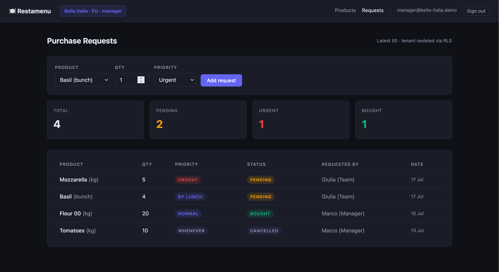
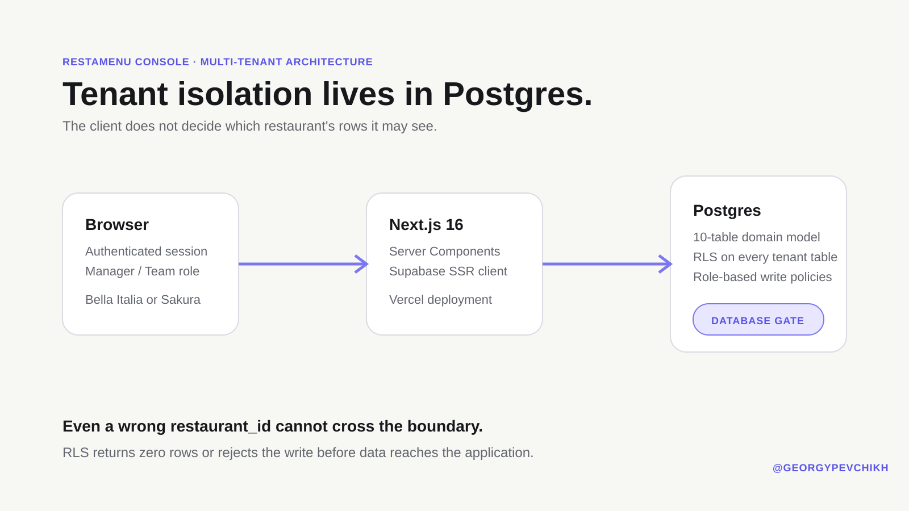
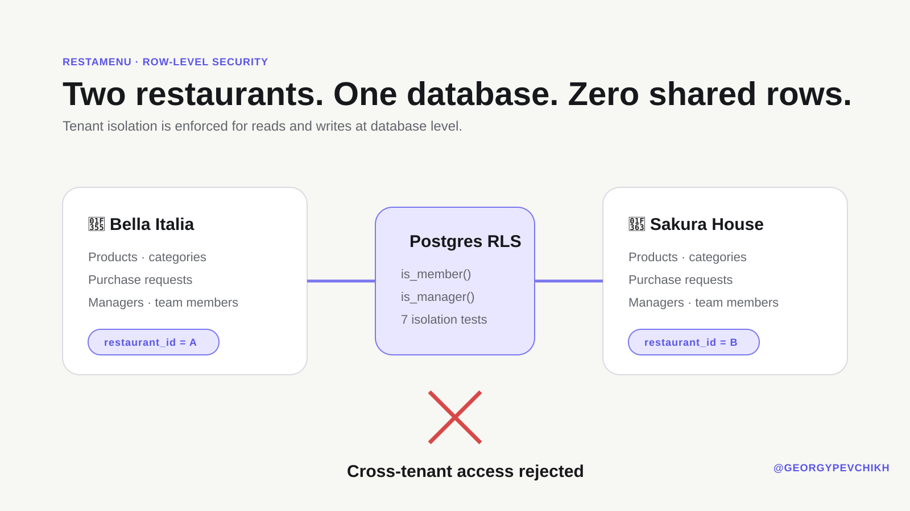
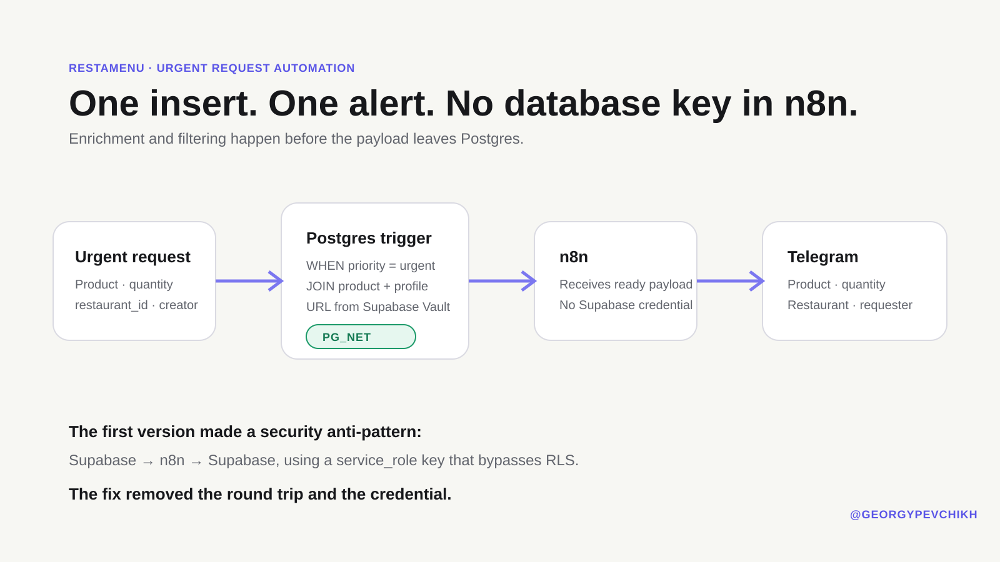
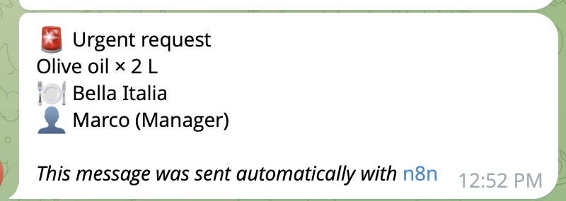
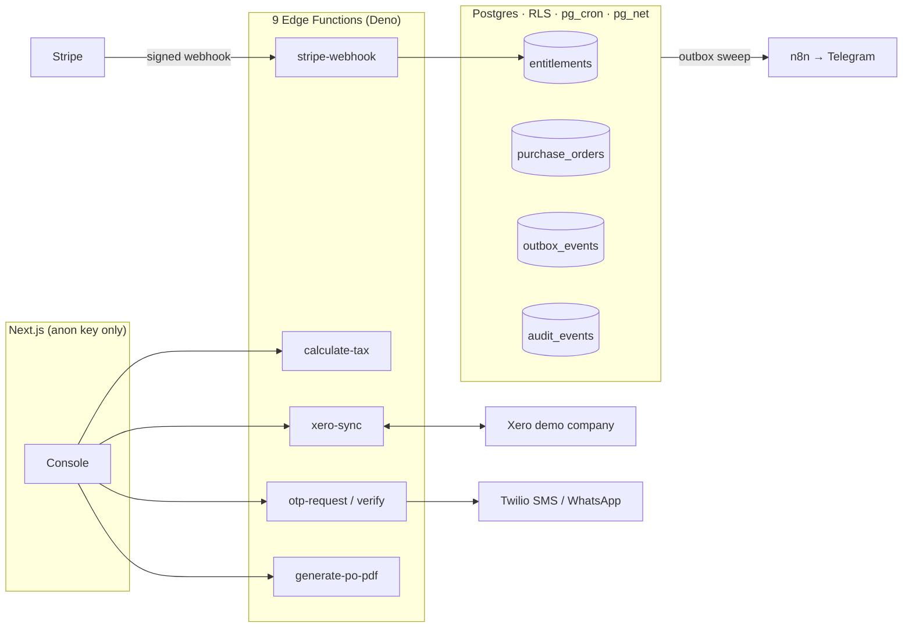
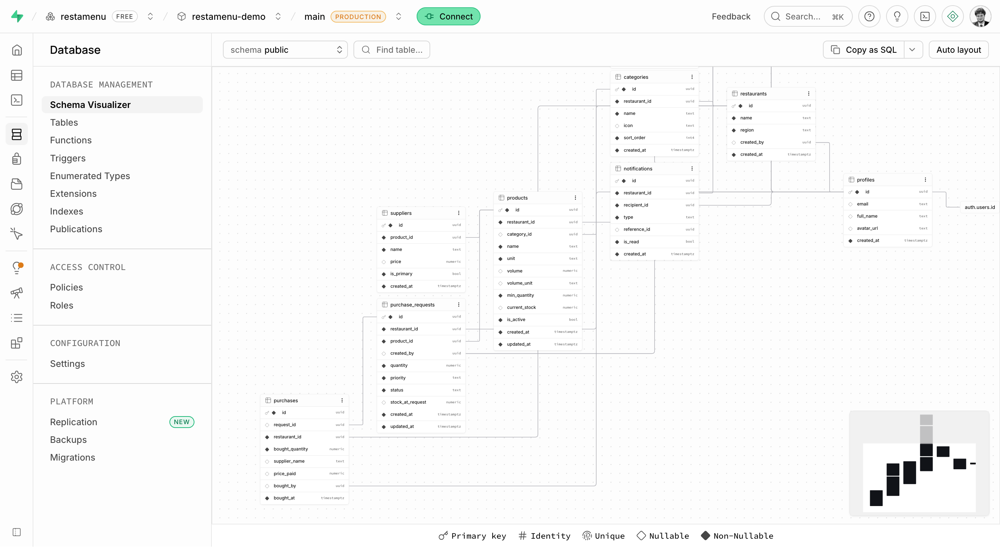

<div align="center">

# 🍽️ Restamenu Console

### A public, executable proof of multi-tenant restaurant operations

**Tenant isolation in Postgres · Stripe-enforced entitlements · tested tax engine in Edge Functions · Xero sync · OTP-gated approvals · transactional outbox · CI-backed security tests**

[](https://restamenu-console-demo.vercel.app)
[](https://github.com/georgypevchikh/restamenu-console-demo/actions/workflows/ci.yml)
[](https://nextjs.org/)
[](https://supabase.com/)
[](https://stripe.com/)
[](https://deno.com/)

**Designed and built independently by [Georgy Pevchikh](https://github.com/georgypevchikh).**

</div>



## Why this demo exists

Restamenu is an inventory and purchasing product for restaurant teams. The main mobile application is private and in active development, so this repository turns its most important engineering properties into public, inspectable proof.

This is not a static portfolio mockup. It is a deployed application with two live tenants, role-based users, database-enforced isolation, real Postgres migrations, integration tests, and an event-driven Telegram automation.

> **The central design decision:** tenant isolation lives in the database, not in a client-side filter. If application code supplies the wrong `restaurant_id`, Postgres returns zero rows or rejects the write.

## Review the live application

Open **[restamenu-console-demo.vercel.app](https://restamenu-console-demo.vercel.app)** and sign in with reviewer credentials supplied privately by the project owner.

| Tenant | Manager | Team member |
|---|---|---|
| 🍕 Bella Italia | `manager@bella-italia.demo` | `staff@bella-italia.demo` |
| 🍣 Sakura House | `manager@sakura-house.demo` | `staff@sakura-house.demo` |

Shared passwords are deliberately not published or embedded in the client bundle: public reusable credentials can be changed or taken over through an authentication API even when database RLS is correct.

Suggested proof path:

1. Sign in as **Bella Italia — Manager** and inspect Products and Requests.
2. Sign out and switch to **Sakura House — Manager**.
3. Observe that the data set changes completely: both tenants share one database, but not one row set.
4. Switch between Manager and Team to see role-aware identity and write behavior.

## What is proven

| Engineering claim | Executable proof |
|---|---|
| Tenant isolation is enforced below the UI | RLS policies cover the tenant model through `is_member()` and `is_manager()` security helpers. |
| Reads cannot leak another restaurant's data | Integration tests sign in as both tenants and assert foreign products, categories, requests and profiles are invisible. |
| Writes cannot cross the tenant boundary | A Bella Italia session attempts a Sakura House `INSERT`; Postgres rejects it with `42501`. |
| Roles affect authorization, not just presentation | Manager/team membership is stored in `restaurant_members` and evaluated by database policies. |
| Server rendering does not expose privileged credentials | Server Components fetch with the authenticated user's session; the application does not use `service_role`. |
| Security behavior cannot silently regress | Typecheck, ESLint, production build and eighteen isolation tests run on every pull request and push to `main`, plus Deno checks and tests for the Edge Function layer. |
| Urgent operations produce a real external action | An urgent purchase request triggers a database function, `pg_net`, n8n and a Telegram alert. |
| Paid features are enforced by the database, not the UI | Stripe test-mode subscriptions arrive via signed, idempotent webhooks; a trigger grants/revokes the `billing_pro` entitlement, and RPCs re-check it in Postgres. |
| Financial arithmetic is deterministic and reviewable | The tax engine works in integer minor units with versioned, effective-dated rule sets; every document stores an immutable calculation trace, and the same code passes the same tests under Node and Deno. |
| High-stakes actions demand a second factor | Purchase-order approval requires an SMS/WhatsApp OTP: hash-only storage, cooldowns, per-phone/per-IP caps and a single-use challenge consumed transactionally. |
| External side effects survive failures | Domain events go through a Postgres transactional outbox — pg_cron sweeps, `pg_net` delivery, response reconciliation and exponential backoff, all visible in the audit UI. |

## Architecture



### Application layer

- **Next.js 16 + React 19** for the deployed web console.
- **TypeScript strict mode** across application and test code.
- **React Server Components** for authenticated server-side reads.
- **Supabase SSR** for cookie-based user sessions.
- **Responsive UI** tested at desktop and 375 px mobile width.

### Data and authorization layer

- **Supabase Auth** for four demo identities.
- **Postgres 17** as the source of truth.
- **13 ordered SQL migrations** for schema, RLS, helper functions, automation and teammate-profile reads.
- **Row Level Security** across the tenant data model.
- `SECURITY DEFINER` helpers for non-recursive membership checks.
- **Supabase Vault** for the automation webhook secret.

### Delivery and quality layer

- **Vercel** production deployment.
- **GitHub Actions** CI on pushes and pull requests.
- **Vitest** integration tests against the deployed Supabase project.
- **ESLint 9** with the Next.js flat configuration.
- Separate `typecheck`, `lint`, `build`, and `test` quality gates.

## Tenant isolation



The same authenticated query path is used for both restaurants. Isolation is derived from the user's membership, not from a trusted tenant ID supplied by the browser.

The test suite verifies:

- Bella Italia sees Bella products and never Sakura products.
- Sakura House sees Sakura products and never Bella products.
- categories, requests and teammate profiles follow the same boundary.
- an authenticated cross-tenant write is rejected by Postgres.
- legitimate same-tenant visibility still works, preventing a "secure but unusable" policy set.

See [`tests/tenant-isolation.test.ts`](tests/tenant-isolation.test.ts) and [`009_enable_rls.sql`](supabase/migrations/009_enable_rls.sql).

## Urgent request → Telegram



An urgent request is not merely highlighted in the dashboard. It becomes an operational event:

```text
purchase_requests INSERT
        ↓
Postgres trigger: priority = urgent
        ↓
JOIN product + restaurant + requester
        ↓
pg_net HTTP call using a URL from Supabase Vault
        ↓
n8n receives a complete payload — no database credential
        ↓
Telegram alert
```

<p align="center">
  
</p>

The database trigger is intentionally filtered with a `WHEN` clause, so normal requests never enter the automation. Seed operations temporarily disable the trigger to avoid sending synthetic alerts.

### The security mistake that changed the design

The first implementation sent an insert event to n8n and queried Supabase again to enrich it with product and requester names:

```text
Supabase → n8n → Supabase
```

That round trip required a `service_role` credential inside n8n. The key bypasses RLS completely — exactly the security boundary this demo is meant to prove.

The final design moved filtering and enrichment into the Postgres trigger function, reads the webhook URL from Vault, and sends a ready-to-use payload. The second Supabase call and privileged n8n credential were removed.

See [`011_urgent_request_webhook.sql`](supabase/migrations/011_urgent_request_webhook.sql).

## Billing & Supplier Sync

The console's second layer: subscription billing, priced purchase orders,
accounting sync and delivery guarantees — built on the same principle as the
tenant model. **The web deployment still holds only the anon key.** Every
privileged operation is one of nine Supabase Edge Functions with its own
scoped secrets; functions acting for a user forward the caller's JWT so RLS
keeps deciding what a tenant can see.



**The flow a reviewer can walk end-to-end:**

1. **Subscribe** — the free tenant upgrades through Stripe test-mode Checkout
   (card `4242 4242 4242 4242`). The signed webhook is verified and recorded
   in an idempotency ledger; out-of-order events are detected and skipped; a
   trigger grants the `billing_pro` entitlement in the same transaction.
2. **Price** — pending purchase requests become a purchase order. The
   `calculate-tax` Edge Function selects the rule-set version effective today
   (standard/reduced VAT by category, withholding above a threshold,
   half-up or banker's rounding — in integer cents, never floats) and returns
   a full trace, persisted immutably next to the document.
3. **Approve** — approval is OTP-gated: a 6-digit code via a
   provider-agnostic adapter (Twilio SMS, Twilio WhatsApp sandbox, or a
   console fallback), stored only as a salted HMAC, with cooldowns and
   per-phone/per-IP rate limits enforced in SQL. The verified challenge is
   consumed inside the approval transaction — it can never approve twice.
4. **Document** — the approved PO renders as a PDF from the persisted trace.
5. **Sync** — the PO is pushed to a Xero demo company as a draft bill via
   OAuth 2.0; all bill pages import back into a timestamp-fenced mirror table,
   where records absent from a complete later snapshot are marked stale rather
   than silently retained as current. Tokens are encrypted at
   rest with a Vault key; refresh-token rotation is compare-and-swap so
   concurrent refreshes cannot clobber each other. Suppliers map to durable
   Xero ContactIDs (with deterministic external ContactNumbers for new
   contacts), and retries reconcile a tenant-qualified PO Reference
   before using a fresh, short-lived request idempotency key. Ambiguous
   duplicate contacts/bills or a remote/local total mismatch stop instead of
   guessing. Explicit tax/withholding adjustment lines preserve the PO payable
   total without claiming jurisdiction-specific Xero tax-account mapping.
   Every push, pull and refresh lands in a sync journal.
6. **Deliver** — domain events (approval, subscription changes, Xero pushes)
   go through a transactional outbox: pg_cron sweeps post them to n8n via
   `pg_net`, a reconciliation pass matches the async responses, and failures
   retry with exponential backoff — all watchable on the Audit page.

**Honest scope:** everything runs against sandboxes — Stripe test mode, the
Xero demo company, Twilio's sandbox. This demonstrates the engineering
(signature verification, idempotency, ordering, encryption, rate limiting,
delivery guarantees), not commercial production billing history.

Design details: [`docs/billing-extension-plan.md`](docs/billing-extension-plan.md) ·
setup: [`docs/SETUP.md`](docs/SETUP.md)

## Data model

The schema models restaurant membership, products, categories, suppliers, purchase requests, completed purchases and notifications. Tenant-owned tables carry `restaurant_id`, creating one consistent authorization boundary.



## Product behavior

- Four reviewer identities across two restaurants and two roles; credentials are distributed privately.
- Product inventory with category, unit, minimum quantity and current stock.
- Purchase requests with quantity, priority, status and requester identity.
- Summary cards for total, pending, urgent and bought requests.
- Role and tenant context visible in the navigation.
- Mobile-safe navigation and horizontally scrollable data tables.
- Explicit server-action validation and surfaced failures instead of silent form resets.

## Stack

| Concern | Technology |
|---|---|
| Framework | Next.js 16, React 19, Server Components |
| Language | TypeScript 5, strict mode |
| Authentication | Supabase Auth, SSR session cookies |
| Database | Supabase Postgres 17 |
| Authorization | Postgres Row Level Security |
| Secrets | Supabase Vault |
| Event delivery | Postgres trigger, `pg_net` |
| Workflow automation | n8n Cloud |
| Notification channel | Telegram Bot API |
| Testing | Vitest, `@supabase/supabase-js`, WebSocket polyfill |
| Quality | ESLint 9, TypeScript, production build gate |
| CI/CD | GitHub Actions, Vercel |

## Repository map

```text
app/                         Next.js routes and Server Components
├── api/auth/signout/        Server-side session termination
├── dashboard/               Tenant-aware products view
└── dashboard/requests/      Request UI and validated Server Action
components/                  Responsive UI components
lib/supabase/                Browser and server Supabase clients
supabase/migrations/         Ordered schema, RLS and automation history
supabase/seed.sql            Two coherent demo tenants
tests/tenant-isolation.test.ts
.github/workflows/ci.yml     Typecheck → lint → build → isolation tests
```

## Run locally

### Prerequisites

- Node.js 20+
- a Supabase project intended for demo data

### Install and configure

```bash
git clone https://github.com/georgypevchikh/restamenu-console-demo.git
cd restamenu-console-demo
npm install
cp .env.example .env.local
```

Fill only the public project values used by the authenticated client:

```env
NEXT_PUBLIC_SUPABASE_URL=...
NEXT_PUBLIC_SUPABASE_ANON_KEY=...
```

Apply [`supabase/migrations`](supabase/migrations) in numeric order, create demo Auth users, then run [`supabase/seed.sql`](supabase/seed.sql). Migration `011` expects the n8n webhook URL to exist in Supabase Vault under `n8n_urgent_webhook_url`; it is never committed to this repository.

```bash
npm run dev
```

### Validate

```bash
npm run typecheck
npm run lint
npm run build
npm test
```

The integration tests intentionally authenticate through the anon client. Do **not** add a `service_role` key to the test environment: it bypasses the policies the suite is designed to verify.

## Engineering decisions

| Decision | Why |
|---|---|
| RLS instead of client-side tenant filters | Authorization remains correct even when application code is wrong. |
| Authenticated integration tests instead of admin queries | The tests exercise the same policy boundary as a real user. |
| Server Components for reads | Keeps data fetching close to the server session and reduces client data plumbing. |
| Postgres-side event filtering | Only urgent rows leave the database; normal inserts create no workflow noise. |
| Database-side payload enrichment | n8n needs neither a callback query nor Supabase credentials. |
| Vault-backed webhook URL | A public repository never reveals the endpoint that can send Telegram alerts. |
| Trigger disabled during seed | Reproducible demo data should not create operational side effects. |

## Scope

This repository is a focused public console, not the complete Restamenu product. The private mobile application covers the broader end-of-shift inventory and shopping workflow. This demo deliberately concentrates on the parts a screenshot cannot prove: data modeling, tenant security, integration testing, automation, secrets management and deployment.

---

<div align="center">

Built independently by **[Georgy Pevchikh](https://github.com/georgypevchikh)** — product design, data model, application, security policies, tests, automation and deployment.

[Open the live demo](https://restamenu-console-demo.vercel.app) · [View CI](https://github.com/georgypevchikh/restamenu-console-demo/actions) · [Connect on LinkedIn](https://www.linkedin.com/in/georgy-pevchikh-b84967406/)

</div>
