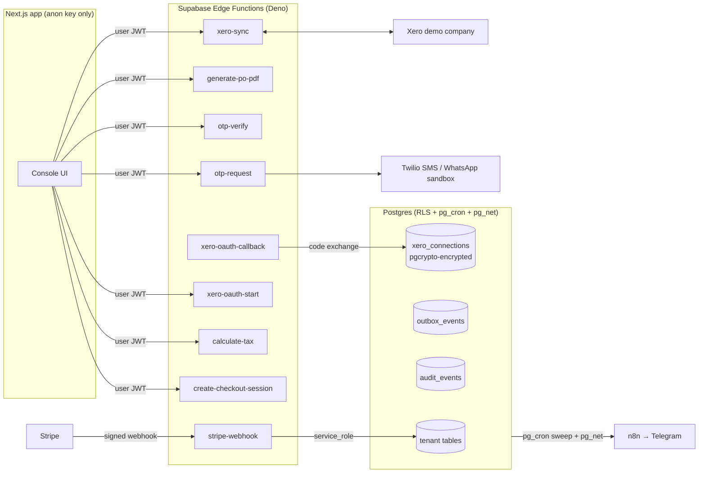

# Billing & Supplier Sync — design document

Extension of the Restamenu Console demo: subscription billing, tested tax
calculation, Xero accounting sync, OTP-gated approvals, PDF purchase orders,
and a transactional outbox — built on the existing multi-tenant RLS core.

Everything here runs against sandbox/test environments (Stripe test mode, Xero
demo company, Twilio sandbox). This is a deployed demo, not a commercial
production system, and the claims stop there.

## Design constraints

1. **The web app never holds a privileged key.** The Vercel deployment keeps
   exactly two env vars (Supabase URL + anon key), as before. Every privileged
   operation — Stripe API, Xero API, Twilio, token storage — lives in a
   Supabase Edge Function with its own scoped secrets.
2. **RLS stays the enforcement boundary.** Edge Functions that act on behalf of
   a user forward the caller's JWT and read through the anon-key client, so
   Postgres policies keep deciding what a tenant can see. `service_role` is
   used only where there is no user in the loop (Stripe webhook, token
   storage, outbox sweep) — and never leaves the function runtime.
3. **Pure logic is runtime-agnostic.** The tax engine, Stripe event reducer,
   and Xero client core contain no Deno or Node APIs, so the same files are
   unit-tested by Vitest (Node) and `deno test`, and bundle cleanly into Edge
   Functions.
4. **Every state change leaves a trail.** Domain transitions write to
   `audit_events`; externally visible events go through `outbox_events` with
   attempt counts, backoff and delivery status visible in the UI.

## Architecture

## Database (migrations 014–021)

| # | File | Contents |
|---|------|----------|
| 014 | `014_enable_pg_cron.sql` | `pg_cron` extension |
| 015 | `015_audit_and_outbox.sql` | `audit_events`, `outbox_events`, `process_outbox()` + `reconcile_outbox()` sweeps on pg_cron, `log_audit()` helper |
| 016 | `016_billing.sql` | `billing_customers`, `subscriptions`, `entitlements`, `stripe_events` (idempotency ledger), `has_entitlement()`, status→entitlement trigger |
| 017 | `017_tax_rule_sets.sql` | `tax_rule_sets` (versioned, effective-dated), `tax_calculations` (immutable traces), seeded v1/v2 rule sets |
| 018 | `018_purchase_orders.sql` | `purchase_orders`, `purchase_order_lines`, `po_counters` + `next_po_number()`, `create_purchase_order()` RPC (security invoker → RLS applies), `approve_purchase_order()` RPC, transition triggers → outbox/audit |
| 019 | `019_xero.sql` | `xero_connections` (tokens `pgp_sym_encrypt`ed with a Vault key, deny-all RLS), `xero_oauth_states`, `xero_sync_log`, `xero_bills`, `store_xero_tokens()` / `get_xero_tokens()` definer functions |
| 020 | `020_otp.sql` | `otp_challenges` (hash only, never the code), `check_otp_rate_limit()` — cooldown, per-phone and per-IP windows, max attempts |
| 021 | `021_seed_billing_demo.sql` | Bella Italia seeded as subscribed (entitlement active), Sakura House left free — the upgrade flow is exercised live with Stripe test cards |

RLS defaults for new tables: members read their tenant's rows; nobody writes
billing/xero/otp system tables directly — writes go through RPCs or
service-role functions. `xero_connections`, `xero_oauth_states`,
`otp_challenges`, `stripe_events` are deny-all for user roles.

## Key mechanics

**Stripe idempotency and ordering.** Every webhook event id is inserted into
`stripe_events` with `on conflict do nothing` — a duplicate delivery is
acknowledged and skipped. Out-of-order protection: `subscriptions` stores the
`created` timestamp of the last applied event and ignores older ones.
Signature verification uses `constructEventAsync` (the sync variant needs Node
crypto, which Deno does not provide).

**Entitlement lifecycle.** `active`/`trialing` → entitlement on;
anything else → off. The trigger writing entitlements also writes the audit
row and an outbox event, in the same transaction as the subscription update.

**Tax engine.** Works in integer minor units. A rule set is a versioned,
effective-dated JSON document (standard/reduced VAT by category, optional
withholding above a threshold, rounding mode: half-up or banker's, per-line).
Each calculation persists an immutable trace: inputs, rule set version, every
intermediate step, outputs. New versions never mutate old rows — historical
POs keep pointing at the version that priced them.

**Purchase order flow.** Manager groups pending purchase requests into a PO →
`calculate-tax` prices it → `create_purchase_order()` RPC inserts PO + lines +
trace in one transaction (security invoker: RLS re-checks tenant). Approval
is OTP-gated: `otp-request` sends a code via the provider adapter,
`otp-verify` checks the hash and calls `approve_purchase_order()`, which
flips status, stamps the approver, and emits outbox + audit rows atomically.

**Transactional outbox.** Domain triggers insert events in the same
transaction as the change. `process_outbox()` (pg_cron, every minute) posts
pending events to n8n via `pg_net` and records the async request id;
`reconcile_outbox()` matches `net._http_response` rows to mark
delivered/failed and schedules retries with exponential backoff
(`2^attempts` minutes, max 5). The n8n webhook URL and header-auth secret live
in Vault — the repo is public and the workflow authenticates with a dedicated
random secret, never a database credential.

**Xero.** OAuth 2.0 authorization-code flow; the callback is an Edge Function
(browser redirects carry no JWT — it consumes the one-time `state` row, then
rechecks that the initiating user is still a manager before binding a tenant).
Tokens are encrypted at rest; refresh rotates the refresh token, and the
update is guarded so a concurrent refresh cannot clobber a newer token.
Reauthorisation may rotate credentials for the same Xero tenant, but an atomic
database guard rejects a silent switch to another organisation because stored
ContactIDs and InvoiceIDs are tenant-scoped.
`xero-sync` pushes an approved PO as an ACCPAY invoice (bill) and imports
bills back into `xero_bills`. Supplier identities are persisted as Xero
`ContactID` mappings; created contacts carry a deterministic external
`ContactNumber`, while a single exact-name legacy contact can be adopted.
PO writes use a tenant-qualified deterministic
Reference and reconcile it before every potentially duplicate POST. Xero's
six-minute idempotency cache is used only for a timestamped request attempt;
expired keys are never treated as a durable guarantee. Exact-name/Reference
ambiguity stops for manual review. Every push, pull, refresh, and failure
lands in `xero_sync_log`.

Bill import fetches every Xero page with a per-request timeout and performs no
mirror write until the complete snapshot has parsed. One timestamp-fenced SQL
RPC then upserts seen bills and marks previously mirrored, now-absent bills
`is_stale`; an older overlapping import cannot overwrite a newer snapshot.
Transient token/network failures remain retryable and never relabel a valid
connection as expired. Only a fenced `invalid_grant` does that.

The draft bill uses exact persisted PO subtotals plus explicit tax and negative
withholding adjustment lines under `LineAmountTypes: NoTax`; Xero's returned
Total must match `purchase_orders.total_minor` before completion. This proves
financial reconciliation without pretending a generic demo can choose the
correct jurisdiction-specific Xero TaxTypes or withholding accounts; those
remain an explicit live accounting-configuration step.

**OTP.** 6-digit code, HMAC-SHA256 with per-challenge salt, 5-minute expiry,
5 attempts. Rate limits enforced in SQL: 60s cooldown per phone, hourly caps
per phone and per IP. The provider adapter has Twilio SMS, Twilio WhatsApp
sandbox, and a `console` provider (logs the code to function logs) so the
whole flow runs before any Twilio account exists.

**PDF.** `generate-po-pdf` renders the PO (lines, tax breakdown from the
trace, totals) with `pdf-lib` and streams it back; reads go through the
caller's JWT, so a tenant can only ever render its own documents.

## Testing

| Layer | Runner | What is asserted |
|---|---|---|
| Tax engine | Vitest + Deno | rates by category, reduced rates, withholding threshold, rounding modes incl. half-cent cases, effective-date version selection, trace completeness |
| Stripe reducer | Vitest + Deno | event → state transitions, duplicate event skipped, stale event ignored, unknown types acknowledged |
| Webhook signature | Deno | valid signature accepted, tampered payload rejected, wrong secret rejected |
| Xero client core | Vitest | token refresh rotation, retry-on-401-once semantics, sync log entries |
| OTP rules | Vitest (SQL via live db) + pure unit | cooldown, phone/IP caps, max attempts, expiry |
| Tenant isolation | Vitest (live db) | existing suite extended: POs, subscriptions, audit events invisible across tenants; staff cannot create POs; direct approval update rejected |

CI adds a `deno` job (`deno check` + `deno test` over `supabase/functions`)
next to the existing typecheck/lint/build/vitest job. Root `tsconfig` and
ESLint exclude `supabase/functions` — Deno owns its own type-checking.

## Honest claims after shipping

Built and deployed: multi-tenant SaaS with Stripe test-mode subscription
enforcement, signed idempotent webhooks, versioned + unit-tested tax rules in
Edge Functions, Xero OAuth sync against a demo company, provider-agnostic
SMS/WhatsApp OTP with rate limiting, PDF documents, a Postgres transactional
outbox with visible retries, RLS isolation tests, and CI.

Not claimed: commercial production billing history, tax expertise, fintech
architecture, production SRE operations.
